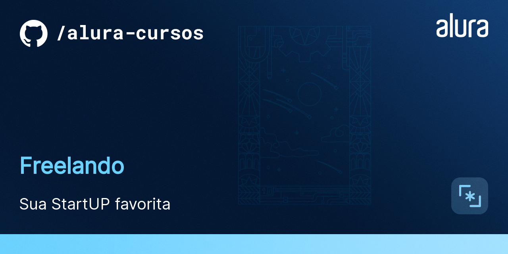

# Freelando

## Tecnologias utilizadas no projeto
* React
* Emotion
* javascript
* React Grid System
* GitHub
* 
## projeto freelando, projeto feito no curso de react da Alura

# link do projeto
   

